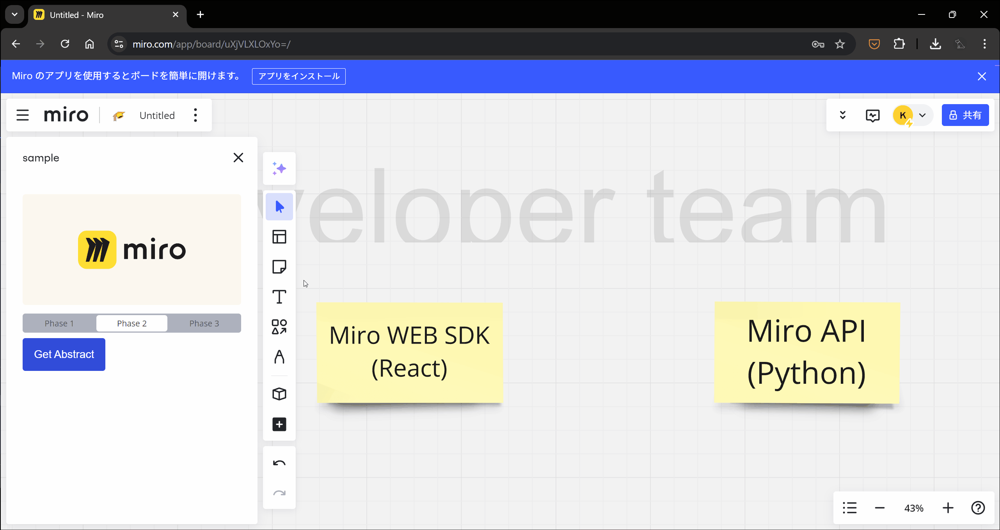

# Miroapp Demo

- Frontend
  - ReactJS, Mirotone CSS
- Backend
  - Python, Langchain, Langserve
  - http://localhost:8000/docs for API documentation


## Demo



## Frontend

### 開発環境のセットアップ手順

```bash
npx create-miro-app@latest
# Name > miroapp-example
# Framework > React
# Flavor > Typescript
mv miroapp-example frontend
```

### 開発用サーバの起動手順

```bash
npm install
npm run build
# Run on localhost:3000
```

## Backend

### 開発環境のセットアップ手順

```bash

```

### 開発用サーバの起動手順

```bash
pip install -r requirements.txt
python server.py
# Run on localhost:8000
```

https://zenn.dev/tyyy/articles/devcontainer_git
